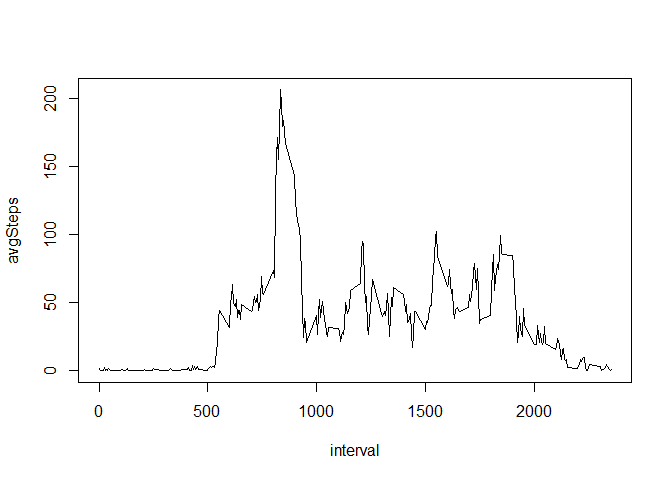
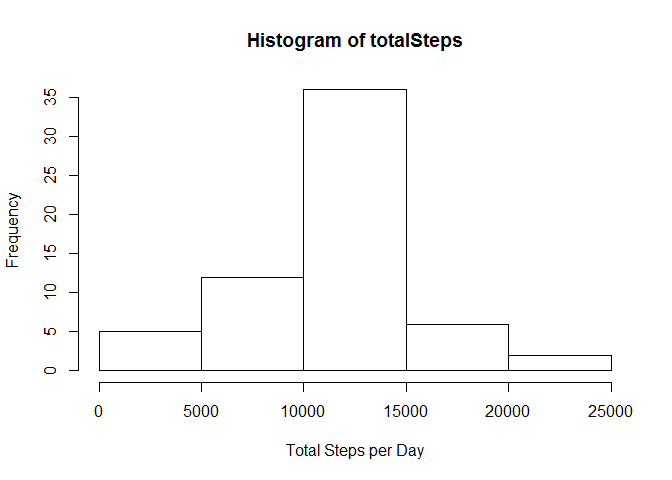
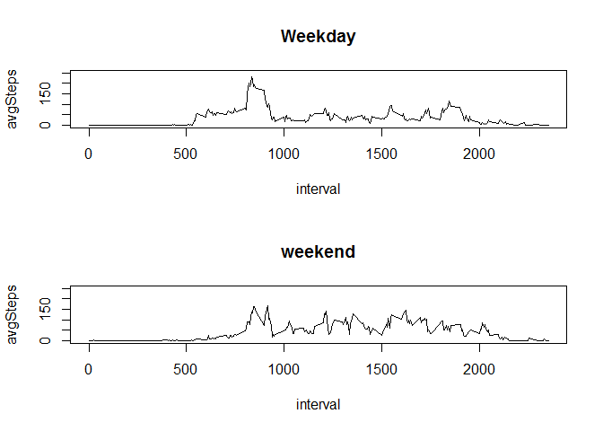

# Reproducible Research: Peer Assessment 1


## Loading and preprocessing the data
Read in the activity.csv file, which was included in the original RepData_PeerAssessment1 repository, forked from http://github.com/rdpeng/RepData_PeerAssessment1 on 01/10/2016.


```r
setwd("C:/Users/Safiya/Desktop/Coursera Data Science/RepData_PeerAssessment1")
activity <- read.csv("./activity.csv")
```
## What is mean total number of steps taken per day?
Calculate the mean number of steps taken per day.  Missing values are excluded from calculation. 

```r
#Calculate total number of steps for each day
stepsDay <- aggregate(activity$steps, by = list(activity$date), sum, na.rm = TRUE)
colnames(stepsDay) <- c("date", "totalSteps") ## assign column names
mean(stepsDay$totalSteps, na.rm = TRUE) ## calculate mean of steps per day
```

```
## [1] 9354.23
```

## What is the average daily activity pattern?
Calculate the mean number of steps taken during each 5 minute interval, across all days.  Missing values will be excluded from calculations.


```r
stepsInterval <- aggregate(activity$steps, by = list(activity$interval), mean, na.rm = TRUE)
colnames(stepsInterval) <- c("interval", "avgSteps") ## assign column names
```
Create time series plot


```r
par(mfrow = c(1,1))
with(stepsInterval, plot(interval, avgSteps, type="l"))
```

\

Which interval has the highest average number of steps across all days?


```r
stepsInterval[which.max(stepsInterval$avgSteps),1]
```

```
## [1] 835
```

## Imputing missing values
Note that there are a number of days/intervals where there are missing values (coded as NA). The presence of missing days may introduce bias into some calculations or summaries of the data.

What is the total number of missing values in the dataset?

```r
sum(is.na(activity$steps))
```

```
## [1] 2304
```

To fill in these missing values, they will be replaced with the average number of steps for that interval across all days where the number of steps were measured.


```r
activity2 <- merge(activity, stepsInterval, by = "interval") ## merge dfs to add the average number of steps per interval
myNa <- is.na(activity2$steps) ## store index of all rows with missing values
activity2$steps2 <- activity2$steps ## create new column with steps
activity2$steps2[myNa] <- activity2$avgSteps[myNa] ## replace missing values with average number of steps for that interval
```
Create a histogram of total number of steps taken per day, using the new data set that has missing values replaced by avg number of steps for that interval.


```r
stepsDate2 <- aggregate(activity2$steps2, by = list(activity2$date), sum, na.rm = TRUE) ## total number of steps by date
colnames(stepsDate2) <- c("date", "totalSteps") ## assign column names

with(stepsDate2, hist(totalSteps, xlab = "Total Steps per Day"))
```

\
Calculate mean and median total steps per day.

```r
mean(stepsDate2$totalSteps) ##mean total steps per day
```

```
## [1] 10766.19
```

```r
median(stepsDate2$totalSteps) ##median total steps per day
```

```
## [1] 10766.19
```
How does this compare to the mean and median total steps per day, prior to replacing NA values?

```r
mean(stepsDay$totalSteps, na.rm = TRUE) ##mean total steps per day before missing values are replaced
```

```
## [1] 9354.23
```

```r
median(stepsDay$totalSteps, na.rm = TRUE) ##median total steps per day before missing values are replaced
```

```
## [1] 10395
```
The data set was skewed originally due to the missing values.  With the missing values replaced, that skew has now been removed.

## Are there differences in activity patterns between weekdays and weekends?
Create a new factor variable in the dataset with two levels – “weekday” and “weekend” indicating whether a given date is a weekday or weekend day.

```r
activity2$date <- strptime(activity2$date, "%Y-%m-%d") ## convert date variable to date format
activity2$day <- weekdays(activity2$date) ## convert to date to day of week
activity2$week <- as.factor(ifelse(activity2$day %in% c("Saturday","Sunday"), "weekend", "weekday")) ## clasify as weekend or weekday
```
Create panel plot that shows average numer of steps per interval for weekend days vs. weekdays.


```r
stepsInterval2 <- aggregate(activity2$steps2, by = list(activity2$interval, activity2$week), mean) ## find avg steps by day type and interval
colnames(stepsInterval2) <- c("interval", "week", "avgSteps") ## assign column names

stepsIntervalByWk <- split(stepsInterval2, stepsInterval2$week)

par(mfrow = c(2,1))

with(stepsIntervalByWk$weekday, plot(interval, avgSteps, type="l", ylim = c(0,250), main="Weekday"))
with(stepsIntervalByWk$weekend, plot(interval, avgSteps, type="l", ylim = c(0,250), main="weekend"))
```

\
From the plots above it appears that the step patterns differ from weekends to weekdays.  On weekends, the avg number of steps early in the day is lower than weekdays.  However, the avg number of steps throughout the middle part of the day is higher on the weekend than on the weekday.
